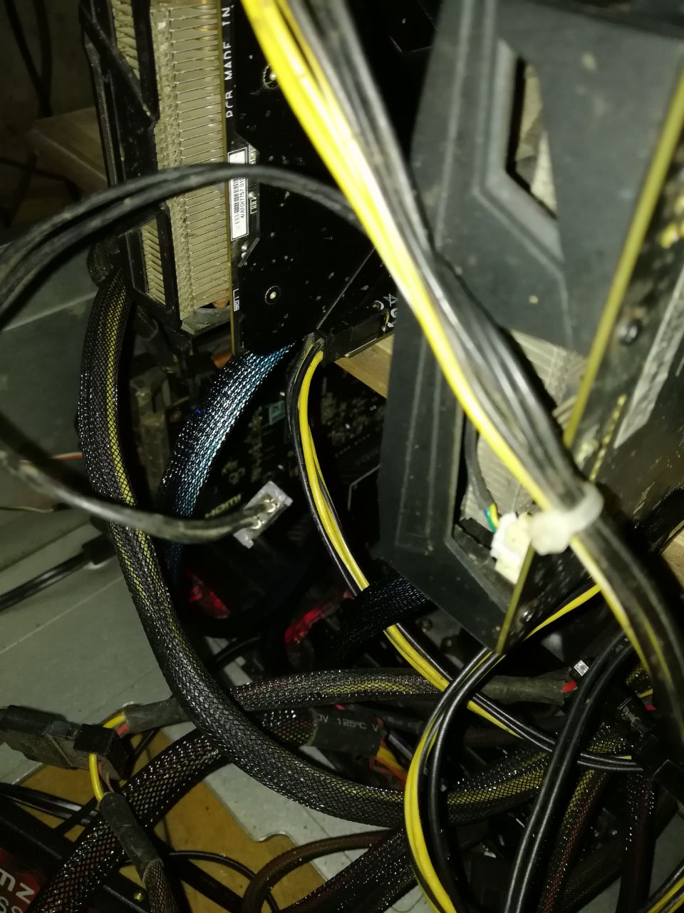
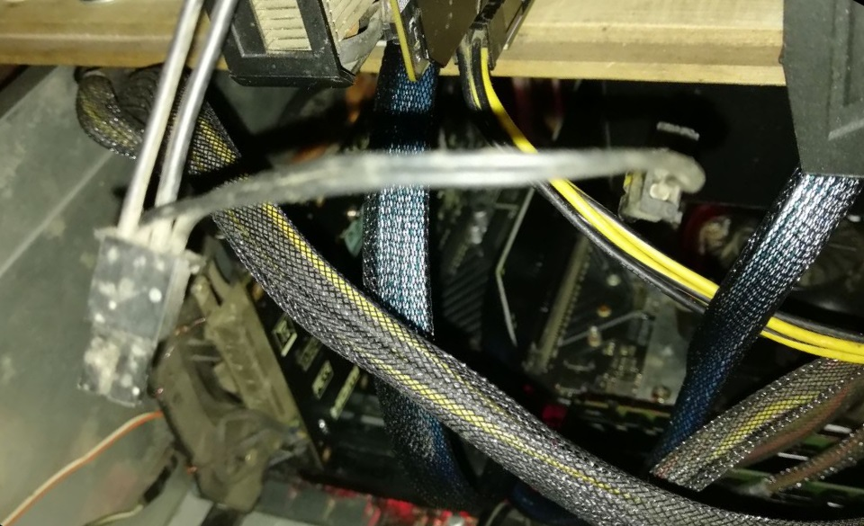
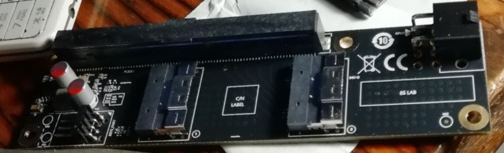
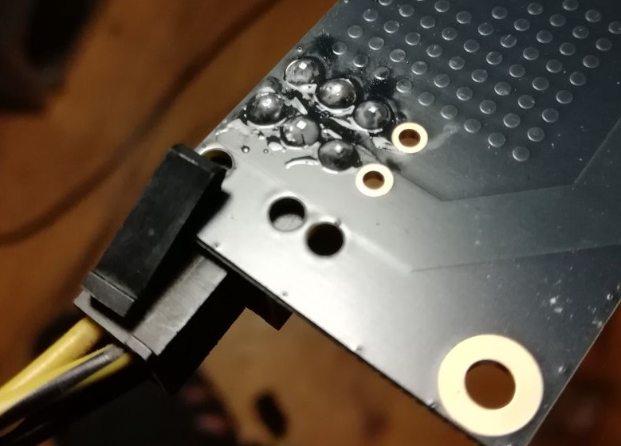
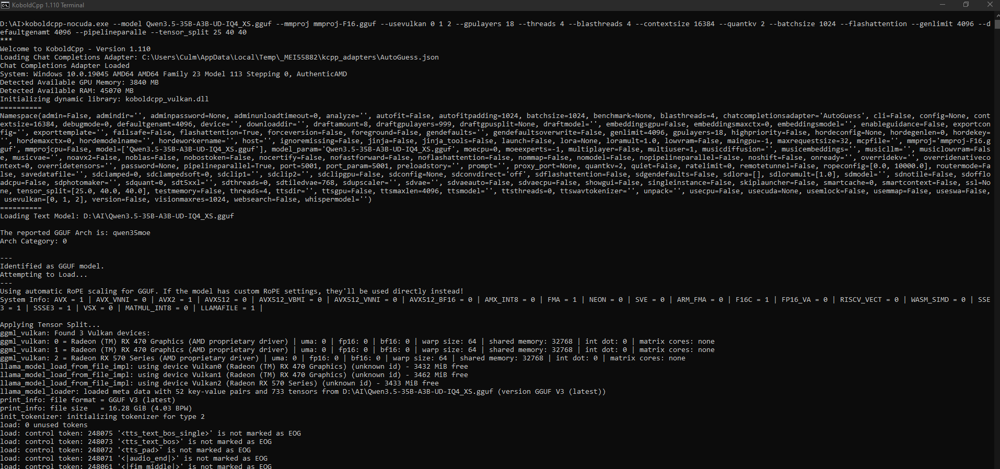
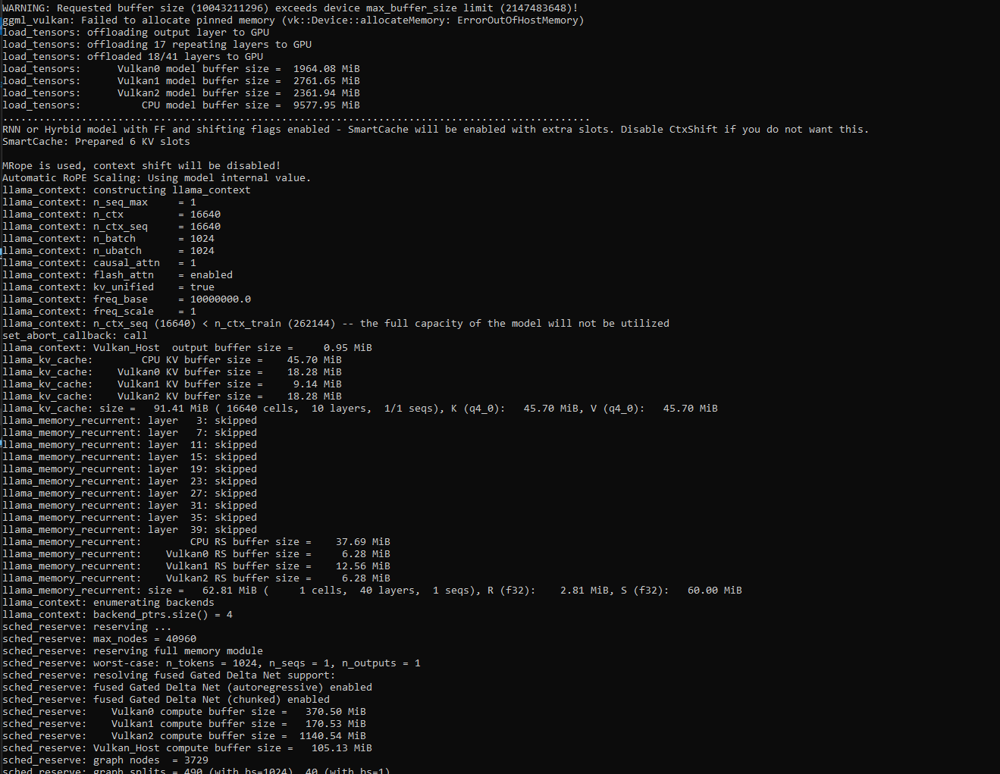
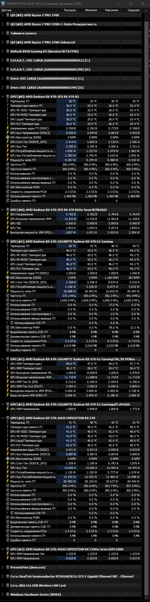
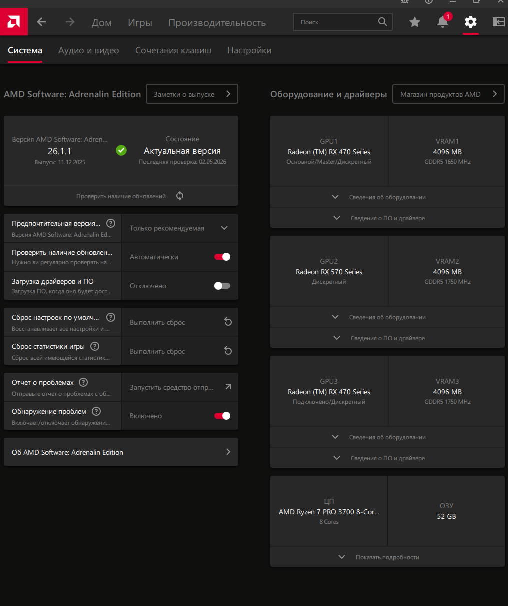

# LLM Local Test

## Goal
Run and benchmark local LLMs on consumer hardware and understand what actually works.

## TL;DR

- 3 GPUs → unstable on standard risers
- SlimSAS + PCIe split (x8 + x4 + x4) → stable
- 4GB GPUs can run LLMs with quantization

👉 Main takeaway:
Hardware setup matters more than expected

---

## Summary

This project shows how to run local LLMs on low-VRAM GPUs (4GB) using a custom multi-GPU setup.

Key result:
👉 Stable multi-GPU inference achieved after fixing PCIe configuration and replacing risers with SlimSAS.

---

## Context

This experiment was done on a home setup built from бывшего майнинг-оборудования.

Hardware evolved during testing:
- Ryzen 5 3600 → Ryzen 7 3700
- Multiple AMD GPUs (RX470 / RX570 4GB)
- RAM: 52 GB

Motherboard limitations played a key role:

- 2x PCIe x16 slots:
  - one slot has full x16 lanes
  - second slot has only x4 lanes

---

## PCIe Configuration

To support multiple GPUs, PCIe lanes had to be split in BIOS.

Tested configurations:
- x8 + x8 → system did NOT work properly
- x8 + x4 + x4 → stable configuration

👉 Final working setup: x8 + x4 + x4

One x4 slot is currently unused.  
Possible future test:
👉 connecting an additional GPU to the remaining x4 lanes

---

## Connection Experiments

Several approaches were tested:

1. Simple PCIe splitter (x8 + x8)
   - rejected due to instability

2. PCIe expansion board (4 GPUs via standard risers)
   - rejected due to possible signal issues

3. SFF-8611
   - considered, but not selected

4. SFF-8654 (SlimSAS)
   - selected as the most reliable solution

👉 Final choice: SlimSAS risers (more expensive, but stable)

---

## Key Insight

Initial setup with standard mining risers was unstable for AI inference.

After switching to SlimSAS:
👉 system became stable even with 3+ GPUs

---

## Setup

Custom multi-GPU setup using risers and external mounting.

This setup was built step by step during experiments with different configurations.

### Hardware layout

- GPUs are connected via risers
- External mounting (not a standard closed case)
- Multiple GPUs running in parallel

### Connection details

- Initial setup used standard mining risers
- Later replaced with SlimSAS (SFF-8654) risers for stability

### Photos

#### GPU rig

#### Alternative angle

#### Riser connection

#### Bottom / connectors

---

## What didn’t work

During initial experiments, the system was unstable when using multiple GPUs.

### 3 GPU issue

When trying to run 3 GPUs on the initial setup:

- System freezes during model loading
- Random crashes under load
- GPUs were not always detected correctly
- Inference could not start or was extremely slow

👉 In practice:
no model worked reliably with 3 GPUs in this configuration.

---

### Conditions

- Standard mining risers were used
- Different connection options were tested
- PCIe configuration was not optimal

---

### Important observation

- 1 GPU → stable
- 2 GPUs → mostly stable
- 3 GPUs → unstable / unusable

👉 The issue appeared consistently when adding the third GPU
This issue was one of the main blockers in the entire setup.

---

## What fixed it

The instability issue was resolved after changing the hardware connection approach.

### Key change

Standard mining risers were replaced with SlimSAS (SFF-8654) risers.

---

### Result after change

- System became stable under load
- All GPUs detected correctly
- No crashes during model loading
- Inference started working reliably

👉 Multi-GPU setup finally became usable

---

### Additional factors

- Proper PCIe lane split (x8 + x4 + x4)
- More stable physical connections
- Reduced signal issues compared to standard risers

---

### Summary

Switching to SlimSAS risers was the key factor that made the setup stable.

---

## Result

After hardware adjustments (SlimSAS risers), the system became stable and usable for real inference.

---

### Inference

Models can now be loaded and executed without crashes.

---

### GPU load and monitoring

System shows stable GPU usage during inference.

---

### Stability

- No system crashes under load
- All GPUs detected correctly
- Inference runs consistently

---

### Performance notes

- Performance depends on model size and quantization
- 4GB VRAM per GPU is a major limitation
- Smaller quantized models work best
- Multi-GPU improves usability but not linearly

---

### Conclusion

👉 The system is now stable and capable of running local LLMs on multi-GPU setup.

---

## How to reproduce

1. Configure PCIe split (x8 + x4 + x4)
2. Use SlimSAS risers (not standard mining ones)
3. Start with 1–2 GPUs
4. Use quantized GGUF models
5. Test stability before scaling to 3+ GPUs

---

## Models Tested

### Qwen

- qwen-3-4b-q4_k_m.gguf
- Qwen3.5-35B-A3B-UD-IQ4_XS.gguf
- Qwen3-14B-Q4_K_M.gguf
- Qwen3-9B-IQ4_XS.gguf

---

### Qwen 2.5 (Coder)

- qwen2.5-coder-14b-instruct-q4_k_m.gguf
- qwen2.5-coder-32b-instruct-q4_k_m.gguf

---

### Other models

- Additional GGUF models (various sizes and quantizations)
- Some larger models were tested and later moved to another disk due to space limitations

---

### Quantization formats

- Q4_K_M
- IQ4_XS
- Other GGUF quantization variants

---

### Key observations

- Quantization is critical for low VRAM GPUs
- 4GB GPUs can run models, but with strong limitations
- Larger models require aggressive quantization
- Model selection is more important than raw hardware

👉 Not all models are suitable for this setup

---

## Notes

This project was built entirely on real hardware with real constraints.

---

### Key lessons

- Multi-GPU setups on consumer hardware are not straightforward
- Stability depends heavily on PCIe configuration and connection quality
- Standard mining risers are not always suitable for AI inference
- SlimSAS risers provided a much more stable solution

---

### Hardware insights

- 4GB VRAM per GPU is a major limitation
- Proper quantization is required to run models
- More GPUs ≠ better results without proper configuration

---

### Practical advice

- Start simple (1–2 GPUs) before scaling
- Test stability before focusing on performance
- Pay attention to hardware connections, not only software

---

### Final thought

👉 Running LLMs on old mining hardware is possible, but requires experimentation and careful setup.

No hype — only what really works.
