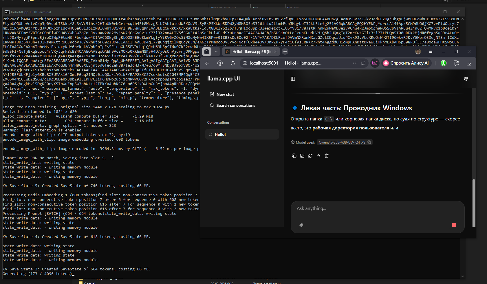

# LLM Local Test

## Goal
Run and benchmark local LLMs on consumer hardware and understand what actually works.

---

## Context

This experiment was done on a home setup built from бывшего майнинг-оборудования.

Hardware evolved during testing:
- Ryzen 5 3600 → Ryzen 7 3700
- Multiple AMD GPUs (RX470 / RX570 4GB)
- RAM: 52 GB

Motherboard limitations played a key role:

- 2x PCIe x16 slots:
  - one slot has full x16 lanes
  - second slot has only x4 lanes

---

## PCIe Configuration

To support multiple GPUs, PCIe lanes had to be split in BIOS.

Tested configurations:
- x8 + x8 → system did NOT work properly
- x8 + x4 + x4 → stable configuration

👉 Final working setup: x8 + x4 + x4

One x4 slot is currently unused.  
Possible future test:
👉 connecting an additional GPU to the remaining x4 lanes

---

## Connection Experiments

Several approaches were tested:

1. Simple PCIe splitter (x8 + x8)
   - rejected due to instability

2. PCIe expansion board (4 GPUs via standard risers)
   - rejected due to possible signal issues

3. SFF-8611
   - considered, but not selected

4. SFF-8654 (SlimSAS)
   - selected as the most reliable solution

👉 Final choice: SlimSAS risers (more expensive, but stable)

---

## Key Insight

Initial setup with standard mining risers was unstable for AI inference.

After switching to SlimSAS:
👉 system became stable even with multiple GPUs

---

## Setup

Custom multi-GPU setup using risers and external mounting.

This setup was built step by step during experiments with different configurations.

### Hardware layout

- GPUs are connected via risers
- External mounting (not a standard closed case)
- Multiple GPUs running in parallel

### Connection details

- Initial setup used standard mining risers
- Later replaced with SlimSAS (SFF-8654) risers for stability

### Photos

#### GPU rig

#### Alternative angle

#### Riser connection

#### Bottom / connectors

---

## Issue: 3 GPU instability

When using 3 GPUs on the initial setup, the system became unstable.

Observed behavior:
- System freezes during model loading
- Random crashes
- Unstable inference

With 1–2 GPUs everything worked fine.

---

## Result

After hardware adjustments (SlimSAS risers), the system became stable.

Inference running:

GPU load:

---

## Models Tested

- Qwen
- DeepSeek
- Various GGUF models

---

## Notes

- Multi-GPU on consumer hardware is tricky
- Stability depends heavily on risers and connections
- Real-world testing is required
